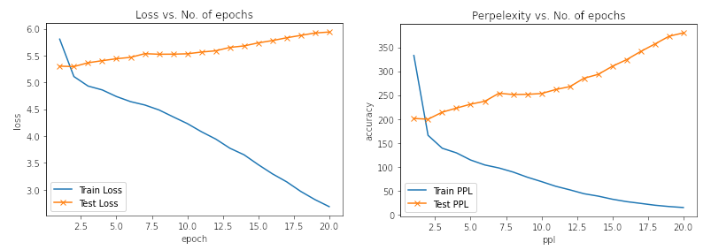
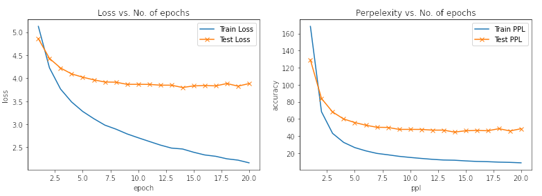

# E2A7_2

# Part 1 - QA Pair

## Loading Data

The file `Question_Answer_Dataset_v1.2.tar.gz` was used. After extracting, the `question_answer_pairs.txt` file in the `S08`, `S09`, and `S10` folders was used.

## Parsing Files
The `pd.read_csv` method was used (with ` sep="\t"`) to read the files. Unfortunately, the file for 2010 was giving an error, so as suggested on [StackOverflow](https://stackoverflow.com/questions/55010807/pandas-errors-parsererror-expected-after), the ` error_bad_lines=False` argument was used

Only the Question and Answer columns were retained.

Also, there were some missing values (Q and A) so those rows were removed using the `pd.dropna` method

## String Reversal

Reversing the input string (as done in the class) improved the results - loss was slighlty less than without reversing string

## Metric
The Accuracy metric cannot be used. Instead, perplexity - which is the exponent of the loss value - is recorded.

## Model
The same model that was presented in the class has been used to train and evaluate (including teacher-forcing for the former)

## Results

#### Training Log
|    epoch    |   Train PPL |  Train Loss |   Valid PPL |  Valid Loss |
| ----------- | ----------- | ----------- | ----------- | ----------- | 
|           1 |      332.43 |      5.8064 |      198.24 |      5.2895 |

#### Loss/Perplexity vs Epochs

# Part 2 - Quora Duplicate Pair

## Loading Data

The file `quora_duplicate_questions.tsv` was used.

## Parsing Files
The `pd.read_csv` method was used (with ` sep="\t"`) to read the files. We are only interested in using the questions marked as duplicate (i.e. `is_duplicate ==1`)

Only the question1 and question2 columns were retained.

There were no missing values 

## String Reversal

Reversing the input string (as done in the class) improved the results - loss was slighlty less than without reversing string

## Metric
The Accuracy metric cannot be used. Instead, perplexity - which is the exponent of the loss value - is recorded.

## Results

#### Training Log
|    epoch    |   Train PPL |  Train Loss |   Valid PPL |  Valid Loss |
| ----------- | ----------- | ----------- | ----------- | ----------- | 
|           1 |      332.43 |      5.8064 |      198.24 |      5.2895 |
|           2 |      167.47 |      5.1208 |      205.08 |      5.3234 |
|           3 |      140.73 |      4.9468 |      212.57 |      5.3593 |
|           4 |      125.51 |      4.8324 |      225.54 |      5.4185 |
|           5 |      116.91 |      4.7614 |      235.11 |      5.4601 |
|           6 |      108.79 |      4.6894 |      248.89 |       5.517 |
|           7 |      97.068 |      4.5754 |      254.31 |      5.5386 |
|           8 |      85.776 |      4.4517 |      259.73 |      5.5597 |
|           9 |      80.453 |      4.3877 |      260.74 |      5.5635 |
|          10 |       71.66 |      4.2719 |      278.31 |      5.6287 |
|          11 |       61.27 |      4.1153 |      286.99 |      5.6594 |
|          12 |       53.81 |      3.9855 |      290.56 |      5.6718 |
|          13 |      47.309 |      3.8567 |      301.51 |      5.7088 |
|          14 |       41.47 |       3.725 |       299.5 |      5.7021 |
|          15 |      34.464 |      3.5399 |      317.75 |      5.7613 |
|          16 |      29.699 |      3.3911 |      335.63 |       5.816 |
|          17 |      25.429 |      3.2359 |       354.8 |      5.8716 |
|          18 |      21.749 |      3.0796 |      352.79 |      5.8659 |
|          19 |      18.595 |      2.9229 |      359.44 |      5.8845 |
|          20 |      15.931 |      2.7683 |      401.65 |      5.9956 |

#### Loss/Perplexity vs Epochs

